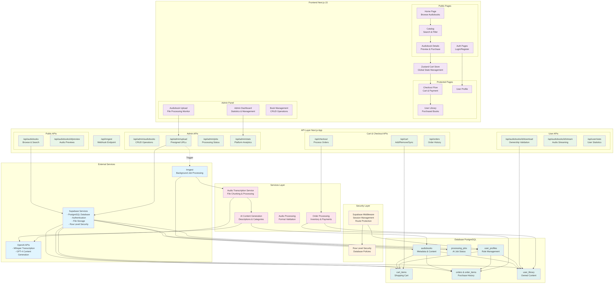

# Audiobook E-Commerce Platform

## Overview

This is a full-featured audiobook e-commerce platform built as a response to a Senior Full Stack Engineer case study. The application demonstrates modern web development practices with AI integration, featuring a customer-facing storefront and comprehensive admin panel.

## Features

### Core E-Commerce Functionality
- Browse audiobook catalog with search and filtering
- Shopping cart with persistent state (supports both authenticated and guest users)  
- Complete checkout flow with simulated payment processing
- User library with download access for purchased content
- Order history and purchase tracking

### Authentication & User Management
- Email/password authentication with password reset functionality
- Google OAuth integration via Supabase Auth
- Role-based access control (admin/user roles)
- Protected routes with middleware-based session management

### AI-Powered Content Processing
- Automatic audiobook transcription using OpenAI Whisper
- AI-generated book descriptions and summaries via GPT-4
- Automatic categorization with up to 3 relevant tags
- Background job processing with real-time status updates

### Admin Panel
- Audiobook upload with progress tracking (supports files up to 500MB)
- Complete CRUD operations for audiobook management
- Processing job monitoring with manual retry capabilities
- User management and platform statistics dashboard
- Cover image upload and management

## Technology Stack

- **Frontend**: Next.js 15 with App Router, TypeScript, Tailwind CSS, shadcn/ui
- **Database**: PostgreSQL with Prisma ORM for type-safe database operations
- **Authentication**: Supabase Auth with Row Level Security
- **File Storage**: Supabase Storage with presigned URL uploads
- **Background Jobs**: Inngest for reliable AI processing pipeline
- **AI Services**: OpenAI (Whisper for transcription, GPT-4 for content generation)
- **State Management**: Zustand for client-side cart state
- **Deployment**: Designed for Vercel (frontend) + Railway (background workers)

## System Architecture



The platform follows a modern full-stack architecture with clear separation of concerns:

- **Frontend Layer**: Next.js 15 with App Router handling both public and protected routes
- **API Layer**: RESTful endpoints with role-based access control
- **Background Processing**: Event-driven AI pipeline using Inngest
- **Security Layer**: Supabase middleware with Row Level Security
- **External Services**: OpenAI for AI processing, Supabase for data/auth/storage

## Architecture Decisions

### Why Next.js 15 with App Router?
- Full-stack capabilities with API routes and Server Components
- Excellent developer experience with TypeScript integration
- Built-in optimization for performance and SEO
- Seamless deployment on Vercel

### Why Supabase?
- Complete backend-as-a-service with PostgreSQL, Auth, and Storage
- Real-time capabilities for live updates
- Row Level Security for fine-grained access control
- Simplified setup compared to managing separate services

### Why Inngest for Background Jobs?
- Event-driven architecture with durable execution
- Built-in retry mechanisms and failure handling
- Visual monitoring and debugging capabilities
- Handles large file processing reliably

### File Processing Strategy
- Large audiobooks (up to 500MB) are chunked into smaller segments
- Accommodates OpenAI Whisper's 25MB file size limit
- Streaming uploads with progress tracking
- Graceful failure handling with job retry mechanisms

## Setup Instructions

### Prerequisites
- Node.js 18+ and npm
- Supabase account and project
- OpenAI API account
- Inngest account (for background jobs)

### Environment Variables
Copy `.env.example` to `.env.local` and configure:

```bash
# Supabase Configuration
NEXT_PUBLIC_SUPABASE_URL=your_supabase_url
NEXT_PUBLIC_SUPABASE_ANON_KEY=your_supabase_anon_key
DATABASE_URL=your_database_url
DIRECT_URL=your_direct_database_url

# OpenAI API
OPENAI_API_KEY=your_openai_api_key

# Inngest (Background Jobs)
INNGEST_EVENT_KEY=your_inngest_event_key
INNGEST_SIGNING_KEY=your_inngest_signing_key
```

### Installation & Development

1. **Clone and install dependencies:**
   ```bash
   git clone [repository-url]
   cd audiobook-platform
   npm install
   ```

2. **Set up the database:**
   ```bash
   npx prisma db push
   npm run seed
   ```

3. **Start the development server:**
   ```bash
   npm run dev
   ```

4. **Access the application:**
   - Customer interface: http://localhost:3000
   - Admin panel: http://localhost:3000/admin (requires admin role)

### Testing the Application

1. **Create an admin user:**
   - Sign up with email/password
   - Manually update the user's role to `admin` in the database

2. **Upload an audiobook:**
   - Access the admin panel
   - Upload an audiobook file (MP3/MP4/WAV supported)
   - Monitor processing status in real-time

3. **Test customer flow:**
   - Browse available audiobooks
   - Add items to cart
   - Complete checkout process
   - Access purchased content in user library

## Error Handling & Reliability

### Implemented Failure Scenarios
- **AI Service Failures**: Automatic retry with exponential backoff
- **File Upload Interruptions**: Resumable uploads with progress tracking
- **Database Transaction Failures**: Automatic rollback and error reporting
- **Background Job Failures**: Dead letter queue with manual retry options

### Testing Strategy
- Type safety throughout with TypeScript and Prisma
- Input validation using Zod schemas
- Error boundaries in React components
- Comprehensive error logging and monitoring

## Project Structure

```
├── app/                    # Next.js App Router
│   ├── (protected)/       # Authentication-required pages
│   ├── api/               # REST API endpoints
│   └── auth/              # Authentication pages
├── components/            # Reusable React components
├── lib/                   # Utilities and services
│   ├── supabase/         # Database and auth clients
│   ├── inngest/          # Background job definitions
│   ├── ai/               # AI service integrations
│   └── audio/            # Audio processing utilities
├── prisma/               # Database schema and migrations
└── docs/                 # Project documentation
```

## Available Commands

- `npm run dev` - Start development server with Turbopack
- `npm run build` - Build for production
- `npm run start` - Start production server  
- `npm run lint` - Run ESLint
- `npm run seed` - Seed database with sample data

## Demo Features

- **Sample audiobooks** with AI-generated content
- **Complete user workflows** from registration to purchase
- **Admin functionality** for content management
- **Real-time processing** updates and job monitoring
- **Responsive design** optimized for mobile and desktop